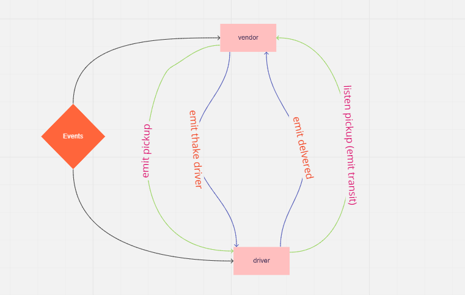

# CAPS

Auther: Abeer Rafati

[REPO LINK](https://github.com/AbeerAl-Rafati/CAPS)

This app to explain how to use events

To use this app:

1. clone this repo
2. cd the repo
3. to download all dependencies used in this app, use in terminal
   `npm i`

4. to run the server use in terminal
   `node vendor.js`

